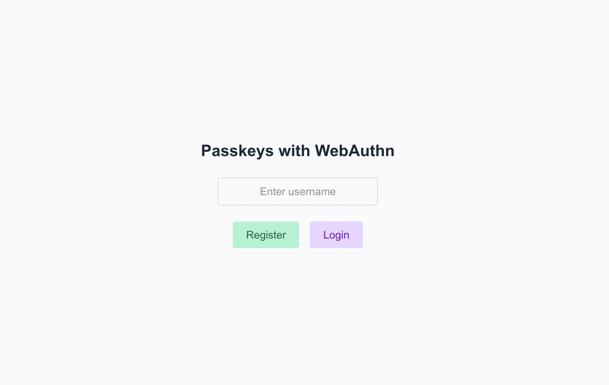
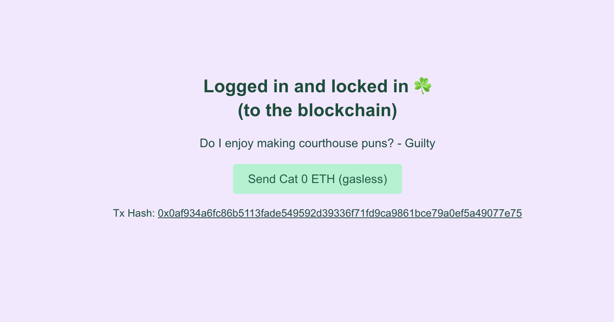

# Passkeys in Privy demo

A tiny Nextjs app that lets you create and login to a Privy wallet with passkey. You can also send a gasless transaction.

Test it out yourself [here](https://privy.mcgee.cat)!




---

## What it does

1. Type your username
1. Click **Register** → Creates privy wallet with passkey
1. Click **Login** → Logs in to privy wallet with passkey

Learn more about Privy [here](https://www.privy.io/).

## Prerequisites

- **Node 20+**
- A modern browser that supports passkeys (Chrome, Edge, Safari, Firefox ≥ 120)

---

## How to run it

Clone this repo

```bash
git clone --branch privy https://github.com/catmcgee/webauthn-nextjs.git privy-example
cd webauth-nextjs
```

Install dependencies

```bash
bun install
```

I like bun :) but you can also use `npm install` or `yarn install` or `pnpm install`.

# 2. Configure .env

```bash
cp .env.local.example .env.local
```

You will need to get privy and pimlico API keys. Free is fine. You can do that [here](https://dashboard.privy.io/) and [here](https://dashboard.pimlico.io/). You will also need to set up a policy ID in Pimlico.

# 3. Run dev server

```bash
bun dev
```

Again you can also use `npm dev` or `yarn dev` or `pnpm dev`.
